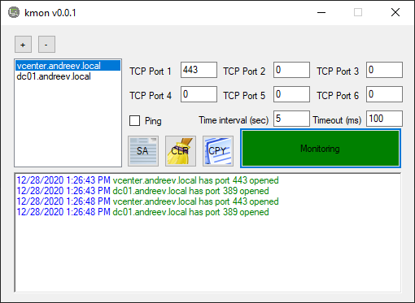

# kmon

kmon is a small .NET utility that can monitor TCP ports and send ICMP packets at regular intervals.
You can specify as many servers as you like and specify up to 5 TCP ports per server.
You can also specify the interval between checks and a timeout delay before a port is marked as not responding.

The GUI looks like this. 

# Usage

From the upper left side, you can add or remove a server and then once that server is selected, you can specify the TCP ports on the right side. Click the big red buttong to start/stop monitoring.

You can *SA* (select all) the text in the log window, *CLR* (clear) it or *CPY* (copy) it to the clipboard.

# Download

You can build your release using Visual Studio and .NET 4.5 or download the executable from the release section.